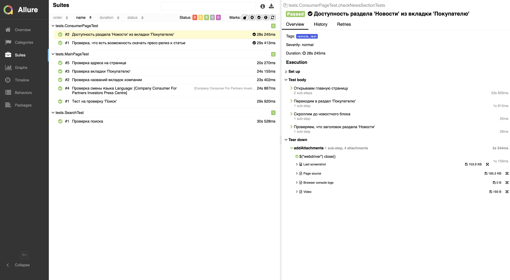
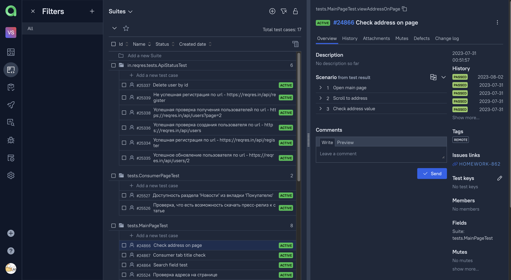
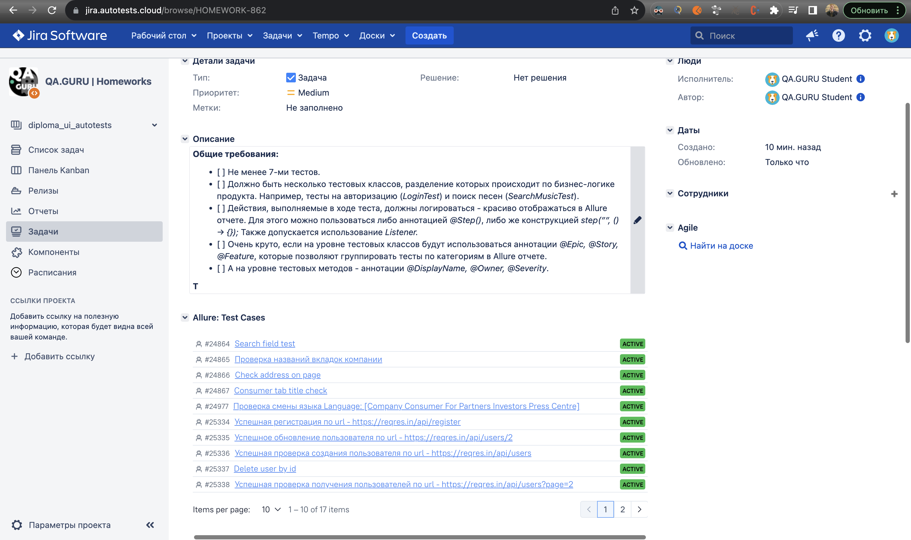
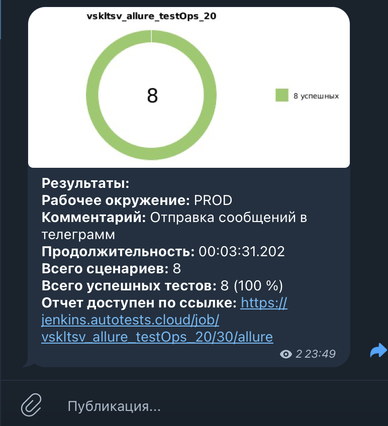

# Проект по автоматизации тестирования для компании [X5Group](https://www.x5.ru/ru/)

> X5 Group — ведущая розничная компания с внушительным портфелем сервисов: от сетей розничной торговли до цифровых и
> медийных платформ.

## **Содержание:**

____

* <a href="#tools">Технологии и инструменты</a>


* <a href="#jenkins">Сборка в Jenkins</a>

* <a href="#console">Запуск из терминала</a>

* <a href="#allure">Allure отчет</a>

* <a href="#allure-testops">Интеграция с Allure TestOps</a>

* <a href="#jira">Интеграция с Jira</a>

* <a href="#telegram">Уведомление в Telegram при помощи бота</a>

* <a href="#video">Примеры видео выполнения тестов на Selenoid</a>

____
<a id="tools"></a>

## <a name="Технологии и инструменты">**Технологии и инструменты:**</a>

<p align="center">


</p>


<a id="console"></a>

### Запуск из терминала

```
gradle clean  test -Denv=locallaunch     
```

```
gradle clean remote_test -Denv=remotelaunch   
```

***Удалённый запуск через Jenkins:***

```bash  
clean remote_test
"-Dbrowser=${BROWSER}" 
"-DbrowserSize=${BROWSER_SIZE}" 
"-DbrowserVersion=${BROWSER_VERSION}" 
"-DbaseUrl=${BASE_URL}"
"-DremoteUrl=${SELENOID}" 
```
### Параметры запуска

<code>browser</code> – браузер, в котором будут выполняться тесты (_по умолчанию - <code>chrome</code>_).

<code>browserVersion</code> – версия браузера (_по умолчанию - <code>100</code>_).

<code>browserSize</code> – размер окна браузера, в котором будут выполняться тесты (_по умолчанию - <code>1920x1080</code>_).

<code>remoteURL</code> - адрес удаленного сервера, где будут запускаться тесты.

<code>baseUrl</code> - адрес базового урла тестируемого сайта.

<a id="jenkins"></a>

## </a><a name="Сборка"></a>Сборка в [Jenkins](https://jenkins.autotests.cloud/job/vskltsv_allure_testOps_20/)</a>

<p align="center">

</p>


<a id="allure"></a>

## </a> <a name="Allure"></a>Allure [отчет](https://jenkins.autotests.cloud/job/vskltsv_allure_testOps_20/allure/)</a>

___

<p align="center">  
  
</p> 

<a id="allure-testops"></a>

## </a>Интеграция с <a target="_blank" href="https://allure.autotests.cloud/project/3593/dashboards">Allure TestOps</a>

<p align="center">  
  
</p> 

<a id="jira"></a>

## </a> Интеграция с <a target="_blank" href="https://jira.autotests.cloud/browse/HOMEWORK-862">Jira</a>

____
<p align="center">  
  
</p>


<a id="telegram"></a>

## </a> Уведомление в Telegram при помощи бота

____
<p align="center">  
  
</p>

____
<a id="video"></a>

## </a> Пример видео выполнения тестов на Selenoid

____
<p align="center">
   
</p>
